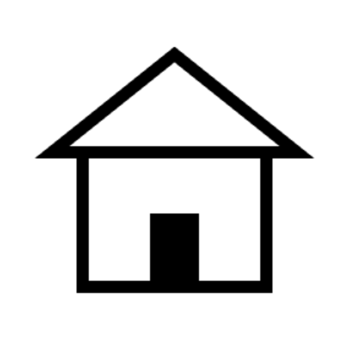
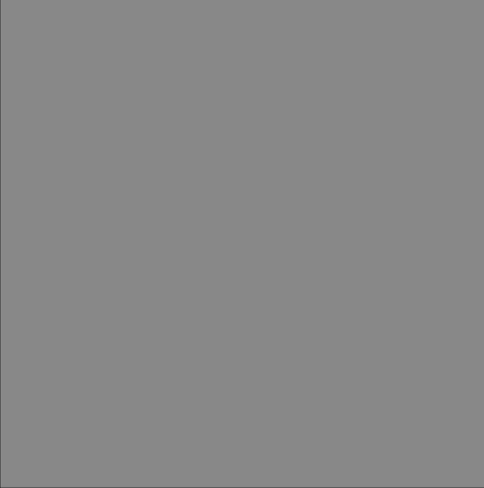

# drawing with javascript

---

## create a context

```html
<canvas id="my-house" width="300" height="300"></canvas>
```

```ts
const canvas = document.getElementById('my-house')
const ctx = canvas.getContext('2d')
```

---



## draw in the context

```ts
// Set line width
ctx.lineWidth = 10

// Wall
ctx.strokeRect(75, 140, 150, 110)

// Door
ctx.fillRect(130, 190, 40, 60)

// Roof
ctx.beginPath()
ctx.moveTo(50, 140)
ctx.lineTo(150, 60)
ctx.lineTo(250, 140)
ctx.closePath()
ctx.stroke()
```

---

### create the canvas programmatically

```html
<div id="app"></div>
```

```ts
const canvas = document.createElement('canvas')
canvas.width = 300
canvas.height = 300
const ctx = canvas.getContext('2d')

function draw() {
  ctx.fillStyle = 'green'
  ctx.fillRect(0, 100, 200, 100)
}

document.addEventListener('DOMContentLoaded', () => {
  const app = document.getElementById('app')
  app.append(canvas)
  draw()
})
```

---

### canvas in vue

```js
<script setup lang="ts">
import { ref, onMounted, onUnmounted } from 'vue'

const canvas = ref<HTMLCanvasElement | null>(null)
const context = ref<CanvasRenderingContext2D | null>(null)

onMounted(() => {
  context.value = canvas.value!.getContext('2d')
  draw()
})

onUnmounted(() => {
  context.value = null
})

function draw() {
  if (!context.value) return
  context.value.fillStyle = 'green'
  context.value.fillRect(0, 100, 200, 100)
}

</script>

<template>
  <canvas width="300" height="300" ref="canvas"></canvas>
</template>
```

---

## create a path

```ts
ctx.strokeStyle = '#000'
ctx.beginPath()
ctx.moveTo(75, 50)
ctx.lineTo(100, 75)
ctx.lineTo(100, 25)
ctx.stroke()
```

```ts
ctx.fill()
```

mdn: [CanvasRenderingContext2D/lineTo](https://developer.mozilla.org/en-US/docs/Web/API/CanvasRenderingContext2D/lineTo)

---

### stroke and fill properties

```ts
ctx.fillStyle = 'blue'
ctx.strokeStyle = 'orange'
ctx.lineWidth = 10
```

---

### draw paths

Primitive forms are available in the CanvasRenderingContext2D api

```ts
ctx.rect(10, 10, 50, 50)
ctx.arc(100, 35, 25, 0, (2 / 3) * Math.PI, true)
ctx.fill()
```

Path methods: [arc](https://developer.mozilla.org/en-US/docs/Web/API/CanvasRenderingContext2D/arc), [rect](https://developer.mozilla.org/en-US/docs/Web/API/CanvasRenderingContext2D/rect), beginPath, moveTo, lineTo, closePath, clearRect, fillRect, strokeRect, bezierCurveTo, quadraticCurveTo, arcTo, ellipse, roundRect. Full list at [CanvasRenderingContext2D](https://developer.mozilla.org/en-US/docs/Web/API/CanvasRenderingContext2D)

---

### Bezier curves

```ts
const start = { x: 10, y: 10 }
const end = { x: 350, y: 250 }
const controlStart = { x: 100, y: 500 }
const controlEnd = { x: 400, y: 100 }

const curve = new Path2D()
curve.moveTo(start.x, start.y)
curve.bezierCurveTo(
  controlStart.x,
  controlStart.y,
  controlEnd.x,
  controlEnd.y,
  end.x,
  end.y
)
ctx.strokeStyle = '#ff6464'
ctx.stroke(curve)
```


<!---
<script setup lang="ts">
import { ref, onMounted, onUnmounted } from 'vue'
const start = { x: 10, y: 10 }
const end = { x: 350, y: 250 }
const controlStart = { x: 100, y: 500 }
const controlEnd = { x: 400, y: 100 }

const WIDTH = 500
const HEIGHT = 500
const BACKGROUND_COLOR = '#242424'
const mouse = { x: 0, y: 0 }
const canvas = ref<HTMLCanvasElement | null>(null)
const context = ref<CanvasRenderingContext2D | null>(null)
let renderi = 0

document.addEventListener('mousemove', (e) => {
  mouse.x = e.offsetX
  mouse.y = e.offsetY
})

type Pos = {
  x: number
  y: number
}

onMounted(() => {
  if (!canvas.value) return
  context.value = canvas.value!.getContext('2d')
  if (!context.value) return
  context.value.lineWidth = 1
  context.value.lineCap = 'round'
  context.value.fillStyle = BACKGROUND_COLOR
  context.value.fillRect(0, 0, WIDTH, HEIGHT)
  context.value.strokeStyle = '#ccc'
  context.value.moveTo(0, 0)

  canvas.value.addEventListener('mousemove', (e) => {
    mouse.x = e.offsetX
    mouse.y = e.offsetY
  })

  draw()
})

onUnmounted(() => {
  context.value = null
})

function draw() {
  if (!context.value) return
  const ctx = context.value

  controlStart.x = mouse.x
  controlStart.y = mouse.y

  // //jsfiddle.net/mrbendel/6rbtde5t/1/
  //http://tulrich.com/geekstuff/canvas/perspective.html


  const dot = (pos: Pos) => {
    const dotPath = new Path2D()
    dotPath.arc(pos.x, pos.y, 5, 0, 2 * Math.PI)
    return dotPath
  }


  ctx.fillStyle = '#f2f2f2'
  ctx.fillRect(0, 0, WIDTH, HEIGHT)

  const vector = new Path2D()
  vector.moveTo(start.x, start.y)
  vector.lineTo(end.x, end.y)
  ctx.strokeStyle = '#646cff'
  ctx.stroke(vector)

  const curveControl = new Path2D()
  curveControl.moveTo(start.x, start.y)
  curveControl.lineTo(100, 500)
  curveControl.lineTo(controlStart.x, controlStart.y)
  curveControl.lineTo(400, 100)
  curveControl.closePath()
  ctx.strokeStyle = '#77cc77'
  ctx.stroke(curveControl)

  const curve = new Path2D()
  curve.moveTo(start.x, start.y)
  curve.bezierCurveTo(
    controlStart.x,
    controlStart.y,
    controlEnd.x,
    controlEnd.y,
    end.x,
    end.y
  )
  ctx.strokeStyle = '#ff6464'
  ctx.stroke(curve)

  const startPath = dot(start)
  const endPath = dot(end)
  ctx.fillStyle = 'blue'
  ctx.fill(startPath)
  ctx.fill(endPath)
  const controlStartPath = dot(controlStart)
  const controlEndPath = dot(controlEnd)
  ctx.fillStyle = 'red'
  ctx.fill(controlStartPath)
  ctx.fill(controlEndPath)

  renderi++
  requestAnimationFrame(draw)
}


</script>

<template>
  <canvas :width="WIDTH" :height="HEIGHT" ref="canvas"></canvas>
</template>


-->

---

### context pollution

```ts
ctx.lineWidth = 10
ctx.fillStyle = 'blue'
ctx.strokeStyle = 'orange'
ctx.rect(10, 10, 50, 50)
ctx.stroke()
ctx.arc(100, 35, 25, 0, 2 * Math.PI)
ctx.fill()
```


---

### path pollution

```ts
ctx.rect(10, 10, 50, 50)
ctx.arc(100, 35, 25, 0, 2 * Math.PI)
ctx.stroke()
```


---

### Path2D

Create a Path2d per object, then append it into the context

```ts
const rectangle = new Path2D()
rectangle.rect(10, 10, 50, 50)

const circle = new Path2D()
circle.moveTo(125, 35)
circle.arc(100, 35, 25, 0, 2 * Math.PI)

ctx.stroke(rectangle)
ctx.fill(circle)
```


---

## helpers

---

### draw a grid

```ts
const grid = new Path2D()
for (let i = 0; i < WIDTH; i += 100) {
  grid.moveTo(i, 0)
  grid.lineTo(i, HEIGHT)
}
for (let i = 0; i < HEIGHT; i += 100) {
  grid.moveTo(0, i)
  grid.lineTo(WIDTH, i)
}
ctx.strokeStyle = 'rgba(255, 255, 255, 0.1)'
ctx.stroke(grid)
```


---

### use text


https://developer.mozilla.org/en-US/docs/Web/API/CanvasRenderingContext2D

---

## try yourself 1

draw eath and moon


<!--

## soluce

const canvas = document.createElement('canvas')
canvas.width = 800
canvas.height = 600
const ctx = canvas.getContext('2d')

let i = 0;

function gameLoop() {
  if (!ctx) throw new Error('unable to create ctx')
  ctx.fillStyle = 'black'
  ctx.fillRect(0, 0, 800, 600)

  const earth = new Path2D()
  earth.arc(100, 100, 25, 0, 2 * Math.PI, true)
  ctx.fillStyle = 'blue'
  ctx.fill(earth)

  const moon = new Path2D()
  moon.arc(200, 100, 15, 0, 2 * Math.PI, true)
  ctx.fillStyle = 'white'
  ctx.fill(moon)

  i ++;
  window.requestAnimationFrame(gameLoop)
}

document.addEventListener('DOMContentLoaded', () => {
  const app = document.getElementById('app')
  if (!app) throw new Error('unable to get app')
  app.append(canvas)
  gameLoop()
})
-->

---

## interact with input

simple drawing app

```ts
const mouse = { x: 0, y: 0 }

canvas.addEventListener('mousemove', (e) => {
  mouse.x = e.offsetX
  mouse.y = e.offsetY
})

function draw() {
  ctx.lineTo(mouse.x, mouse.y)
  ctx.stroke()
  window.requestAnimationFrame(draw)
}
```


<!--
const canvas = document.createElement('canvas')
canvas.width = 400
canvas.height = 400
canvas.style.width = '200px'
canvas.style.height = '200px'
const ctx = canvas.getContext('2d')
ctx.lineWidth = 3
ctx.lineCap = 'round'
ctx.fillStyle = '#222'
ctx.fillRect(0, 0, 400, 400)

ctx.strokeStyle = '#ccc'
ctx.moveTo(0, 0)
const mouse = {x: 0, y:0}

function gameLoop() {
  ctx.lineTo(mouse.x, mouse.y)
  ctx.stroke()
  window.requestAnimationFrame(gameLoop)
}

document.addEventListener('DOMContentLoaded', () => {
  const app = document.getElementById('app')
  app.append(canvas)
  gameLoop()
})

canvas.addEventListener('mousemove', (e) => {
  mouse.x = e.offsetX * 2
  mouse.y = e.offsetY * 2
})
-->

<!--
<script setup lang="ts">
import { ref, onMounted, onUnmounted } from 'vue'

const WIDTH = 400
const HEIGHT = 400
const mouse = { x: 0, y: 0 }
const canvas = ref<HTMLCanvasElement | null>(null)
const context = ref<CanvasRenderingContext2D | null>(null)


onMounted(() => {
  if (!canvas.value) return
  context.value = canvas.value!.getContext('2d')
  if (!context.value) return
  context.value.lineWidth = 3
  context.value.lineCap = 'round'
  context.value.fillStyle = '#222'
  context.value.fillRect(0, 0, WIDTH, HEIGHT)
  context.value.strokeStyle = '#ccc'
  context.value.moveTo(0, 0)

  canvas.value.addEventListener('mousemove', (e) => {
    mouse.x = e.offsetX
    mouse.y = e.offsetY
  })

  draw()
})

onUnmounted(() => {
  context.value = null
})

function draw() {
  if (!context.value) return
  const ctx = context.value
  ctx.lineTo(mouse.x, mouse.y)
  ctx.stroke()
  window.requestAnimationFrame(draw)
}
</script>

<template>
  <canvas :width="WIDTH" :height="HEIGHT" ref="canvas"></canvas>
</template>

-->
