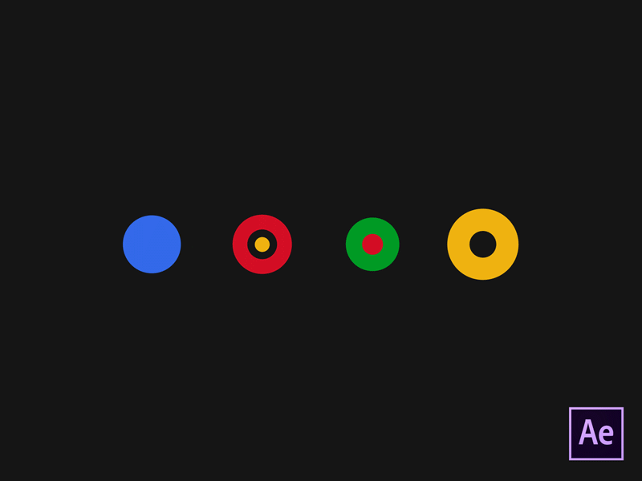
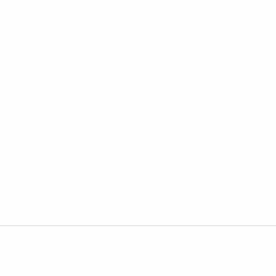
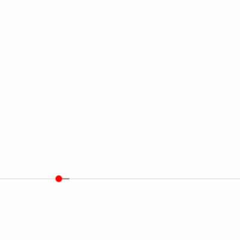
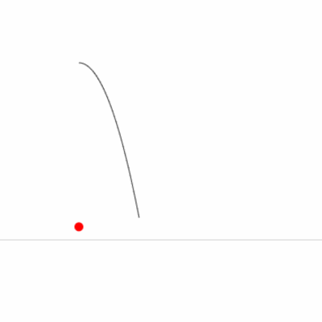
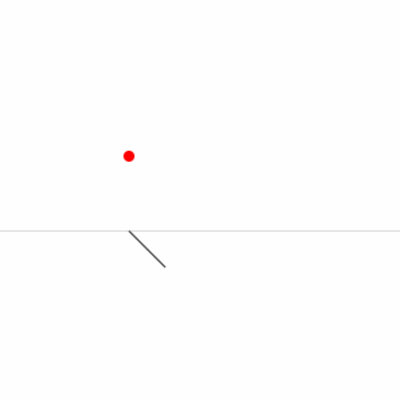
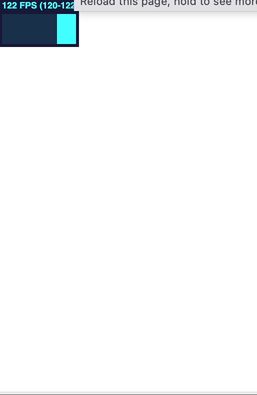
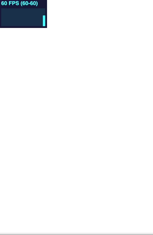

---

## requestAnimationFrame

```ts
function render() {
  console.log("I'm rendering!")
  requestAnimationFrame(render)
}

// start the first rendering
requestAnimationFrame(render)
```

---

## easing

easing is a value between 0 and 1.
0 being the start and 1 the arrival

```ts
const position.x = startpos.x - easing(time) * distance
```

---

### linear easing

the most boring one


```ts
const easingLinear = (n) => n
```

---

### implementation

```ts
const easeLinear = (x: number) => x

function draw() {
  if (!context.value) return
  const ctx = context.value

  ctx.clearRect(0, 0, WIDTH, HEIGHT)

  const floor = new Path2D()
  floor.moveTo(0, center.y)
  floor.lineTo(800, center.y)
  ctx.strokeStyle = '#ccc'
  ctx.stroke(floor)

  const time = renderi / 100
  const positionx = center.x - easeLinear(time) * 200
  const dot = new Path2D()
  dot.arc(center.x, positionx, 5, 0, 2 * Math.PI, true)
  ctx.fillStyle = 'red'
  ctx.fill(dot)

  renderi++
  requestAnimationFrame(draw)
}
```

---

### inCubic easing

strong acceleration


```ts
const easeInCubic = (n) => n * n * n
```

---

### outBounce easing

a ball falling


```ts
const easeOutBounce = n => // see on easings.net
```

---

### try yourself

go on https://easings.net/ and try various easing formulaes



<!--

import config from './config.js'

const canvas = document.createElement('canvas')
canvas.width = 800
canvas.height = 600
const ctx = canvas.getContext('2d')

const easeLinear = n => n
const easeInSquare = n => n * n
const easeInCubic = n => n * n * n
const easeInOutSine = n => -(Math.cos(Math.PI * n) - 1) / 2
const easeOutBounce = n => {
  const n1 = 7.5625;
  const d1 = 2.75;

  if (n < 1 / d1) {
    return n1 * n * n;
  } else if (n < 2 / d1) {
    return n1 * (n -= 1.5 / d1) * n + 0.75;
  } else if (n < 2.5 / d1) {
    return n1 * (n -= 2.25 / d1) * n + 0.9375;
  } else {
    return n1 * (n -= 2.625 / d1) * n + 0.984375;
  }
}
const easing = easeOutBounce

let i = 0;
const center = { x: 400, y: 300 }

function gameLoop() {
  ctx.fillStyle = 'white'
  ctx.fillRect(0, 0, 800, 600)

  const floor = new Path2D()
  floor.moveTo(0, center.y)
  floor.lineTo(800, center.y)
  ctx.strokeStyle = '#ccc'
  ctx.stroke(floor)

  if (i > 100) i = 0
  const distance = 100
  const bar = new Path2D()
  bar.moveTo(center.x, center.y)
  for (let j = 0; j < i; j++) {
    bar.lineTo(center.x + j, center.y + easing((j)/100) * distance)
  }
  ctx.strokeStyle = '#333'
  ctx.stroke(bar)


  const dot = new Path2D()
  dot.arc(center.x, center.y - easing(i/100) * 200, 5, 0, 2 * Math.PI, true)
  ctx.fillStyle = 'red'
  ctx.fill(dot)

  i ++;
  window.requestAnimationFrame(gameLoop)
}

document.addEventListener('DOMContentLoaded', () => {
  const app = document.getElementById('app')
  app.append(canvas)
  gameLoop()
})

-->

---

## time consistency

---

## independent rendering

<style scoped>

div.custom {
  display: flex;
  gap: 8%;
}
article.custom {
 
  width: 45%
}

</style>

don't correlate events to draw events, keep a clean rendering, you'll mess up with performances

<div class="custom">
<article class="custom">
don't do this:

```ts
document.addEventListener('mousemove', () => {
  ctx.arc(ev.pageX, ev.pageY, 25, 0, 2 * Math.PI)
  ctx.fill()
})
```

</article>
<article class="custom">
do this instead:

```ts
let mouse = { x: 0, y: 0 }

document.addEventListener('mousemove', (ev) => {
  mouse.x = ev.pageX
  mouse.y = ev.pageY
})

function render() {
  ctx.arc(ev.pageX, ev.pageY, 25, 0, 2 * Math.PI)
  ctx.fill()
  window.requestAnimationFrame(render)
}
```

</article>
</div>

---

### fps consistency

<!--
old console game (like super mario) weren't running at the same speed in europe and usa/jp
-->

don't do this

```ts
let renderi = 0
function render() {
  ctx.fillText('frame', 10, renderi / 100)
  renderi++
  requestAnimationFrame(render)
}
render()
```

do this

```ts
function render(timestamp) {
  ctx.fillText('time', 10, timestamp / 100)
  renderi++
  requestAnimationFrame(render)
}
requestAnimationFrame(render)
```




<!--

<script setup lang="ts">
import { ref, onMounted, onUnmounted } from 'vue'
import Stats from 'stats.js'

const WIDTH = 500
const HEIGHT = 500
const center = { x: WIDTH / 4, y: HEIGHT / 2 }

const panel = ref<HTMLDListElement | null>(null)
const canvas = ref<HTMLCanvasElement | null>(null)
const context = ref<CanvasRenderingContext2D | null>(null)
let time = 0
let renderi = 0

const stats = new Stats();

onMounted(() => {
  if (!canvas.value) return
  context.value = canvas.value!.getContext('2d')
  if (!context.value) return
  if (!panel.value) return
  stats.showPanel(0); // 0: fps, 1: ms, 2: mb, 3+: custom
  panel.value.appendChild(stats.dom);

  context.value.font = '10px monospace'
  requestAnimationFrame(render)
})


onUnmounted(() => {
  context.value = null
})

function easeOutBounce(x: number): number {
  const n1 = 7.5625;
  const d1 = 2.75;

  if (x < 1 / d1) {
    return n1 * x * x;
  } else if (x < 2 / d1) {
    return n1 * (x -= 1.5 / d1) * x + 0.75;
  } else if (x < 2.5 / d1) {
    return n1 * (x -= 2.25 / d1) * x + 0.9375;
  } else {
    return n1 * (x -= 2.625 / d1) * x + 0.984375;
  }
}

function render(timestamp: number) {
  if (!context.value) return
  stats.begin();
  const ctx = context.value
  time = timestamp

  ctx.clearRect(0, 0, WIDTH, HEIGHT)

  const floor = new Path2D()
  floor.moveTo(0, center.y)
  floor.lineTo(800, center.y)
  ctx.strokeStyle = '#ccc'
  ctx.stroke(floor)

  const positiony = center.y - easeOutBounce(time / 2000) * 200

  const dot = new Path2D()
  dot.arc(center.x, positiony, 5, 0, 2 * Math.PI, true)
  ctx.fillStyle = 'red'
  ctx.fillText(`time`, center.x - 40, positiony)
  ctx.fill(dot)


  const positionyref = center.y - easeOutBounce(renderi / 200) * 200
  const dotref = new Path2D()
  dotref.arc(center.x + 20, positionyref, 5, 0, 2 * Math.PI, true)
  ctx.fillStyle = 'blue'
  ctx.fillText(`frame`, center.x + 20 + 10, positionyref)
  ctx.fill(dotref)

  renderi++
  stats.end();
  requestAnimationFrame(render)
}

</script>

<template>
  <div ref="panel"></div>
  <canvas :width="WIDTH" :height="HEIGHT" ref="canvas"></canvas>
</template>

<style scoped></style>
-->

---

### keep track of event start time

try it yourself:

start animations on mouse click

```ts
type Point = { x: number; y: number }
type Event = { point: Point; time: number; duration: number }
const events = []
```

```ts
function render(timestamp: number) {
  events.forEach((event, index) => {
    const progress = (timestamp - event.time) / event.duration
    if (progress > 1) {
      events.splice(index, 1)
      return
    }
    // draw here
  }
}
```


<!--
<script setup lang="ts">
import { ref, onMounted, onUnmounted } from 'vue'
import Stats from 'stats.js'

type Point = { x: number, y: number }
type Event = { point: Point, time: number, duration: number }

const WIDTH = 500
const HEIGHT = 500

const panel = ref<HTMLDListElement | null>(null)
const canvas = ref<HTMLCanvasElement | null>(null)
const context = ref<CanvasRenderingContext2D | null>(null)
const mouse: Point = { x: 0, y: 0 }

let time = 0

const stats = new Stats();

onMounted(() => {
  if (!canvas.value) return
  context.value = canvas.value!.getContext('2d')
  if (!context.value) return
  if (!panel.value) return
  stats.showPanel(0); // 0: fps, 1: ms, 2: mb, 3+: custom
  panel.value.appendChild(stats.dom);
  canvas.value.addEventListener('mousemove', (e) => {
    mouse.x = e.offsetX
    mouse.y = e.offsetY
  })
  context.value.font = '10px monospace'
  requestAnimationFrame(render)
})

onUnmounted(() => {
  context.value = null
})

function easeOutSine(x: number): number {
  return Math.sin((x * Math.PI) / 2);
}

const events: Event[] = []

function render(timestamp: number) {
  if (!context.value) return
  stats.begin();
  const ctx = context.value
  time = timestamp
  ctx.clearRect(0, 0, WIDTH, HEIGHT)

  events.forEach((event, index) => {
    const progress = (time - event.time) / event.duration
    if (progress > 1) {
      events.splice(index, 1)
      return
    }
    const circle = new Path2D()
    const radius = easeOutSine(progress) * 50
    circle.arc(event.point.x, event.point.y, radius, 0, 2 * Math.PI, true)
    ctx.strokeStyle = 'blue'
    ctx.stroke(circle)
  })
  stats.end();
  requestAnimationFrame(render)
}

function create() {
  events.push({ point: { x: mouse.x, y: mouse.y }, time, duration: 2000 })
}

</script>

<template>
  <div ref="panel"></div>
  <canvas :width="WIDTH" :height="HEIGHT" ref="canvas" @click="create"></canvas>
</template>

<style scoped>
canvas {
  cursor: pointer;
}
</style>
-->
