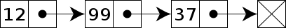

# 2d geometry


(don't panic)

<!--
https://www.educastream.com/formules-trigonometriques-calcul-angles-3eme
-->

---

## A point in a rectangular coordinate system

```ts
type Point = { x: number; y: number }

const a: Point = { x: 10, y: 15 }
```


---

## Math.cos, Math.sin


angles in radians, ranged [0, 2π]

```js
const orbit = (centerx, centery, angle, distance) => {
  const x = centerx + Math.sin(angle) * distance
  const y = centery + Math.cos(angle) * distance
  return { x, y }
}
```


<!-- trigo-orbit2.gif
import config from './config.js'

const canvas = document.createElement('canvas')
canvas.width = 800
canvas.height = 600
const ctx = canvas.getContext('2d')

let mouse = { x: 0, y: 0 }
let i = 2;

const orbit = ([cx, cy], angle, distance) =>
  [cx + Math.sin(angle) * distance, cy + Math.cos(angle) * distance]

function gameLoop() {
  ctx.fillStyle = 'white'
  ctx.fillRect(0, 0, 800, 600)

  const earth = new Path2D()
  earth.arc(200, 200, 5, 0, 2 * Math.PI, true)
  ctx.fillStyle = 'blue'
  ctx.fill(earth)

  const moon = new Path2D()
  const [xmoon, ymoon ]  = orbit([200, 200], i / 100, 100)
  moon.arc(xmoon, ymoon, 5, 0, 2 * Math.PI, true)
  ctx.fillStyle = 'red'
  ctx.fill(moon)

  const orbitalpath = new Path2D()
  orbitalpath.arc(200, 200, 100, 0, 2 * Math.PI, true)
  ctx.strokeStyle = '#ccc'
  ctx.stroke(orbitalpath)

  const horiz = new Path2D()
  horiz.moveTo(200, 200)
  horiz.lineTo(xmoon, 200)
  ctx.strokeStyle = '#ccc'
  ctx.stroke(horiz)

  const vert = new Path2D()
  vert.moveTo(xmoon, 200)
  vert.lineTo(xmoon, ymoon)
  ctx.strokeStyle = '#ccc'
  ctx.stroke(vert)

  const diag = new Path2D()
  diag.moveTo(200, 200)
  diag.lineTo(xmoon, ymoon)
  ctx.strokeStyle = '#ccc'
  ctx.stroke(diag)

  i ++;
  window.requestAnimationFrame(gameLoop)
}

document.addEventListener('DOMContentLoaded', () => {
  const app = document.getElementById('app')
  app.append(canvas)
  gameLoop()
})
-->

---

### try yourself 2

moon shall circle around earth

```ts
type Point = { x: number; y: number }
function getPointAtAngle(
  center: Point,
  angle: number,
  distance: number
): Point {
  return {
    x: center.x + Math.cos(angle) * distance,
    y: center.y + Math.sin(angle) * distance,
  }
}
```


<!--
<script setup lang="ts">
import { ref, onMounted, onUnmounted } from 'vue'

type Point = { x: number; y: number }

const WIDTH = 500
const HEIGHT = 500
const BACKGROUND_COLOR = '#242424'
const mouse = { x: 0, y: 0 }
const canvas = ref<HTMLCanvasElement | null>(null)
const context = ref<CanvasRenderingContext2D | null>(null)
let renderi = 0

document.addEventListener('mousemove', (e) => {
  mouse.x = e.offsetX
  mouse.y = e.offsetY
})


onMounted(() => {
  if (!canvas.value) return
  context.value = canvas.value!.getContext('2d')
  if (!context.value) return

  draw()
})

onUnmounted(() => {
  context.value = null
})

function moonPos(center: Point, angle: number, distance: number): Point {
  return {
    x: center.x + distance * Math.cos(angle),
    y: center.y + distance * Math.sin(angle),
  }
}

function draw() {
  if (!context.value) return
  const ctx = context.value

  ctx.clearRect(0, 0, WIDTH, HEIGHT)

  const earth = new Path2D()
  earth.arc(200, 200, 25, 0, 2 * Math.PI, true)
  ctx.fillStyle = 'blue'
  ctx.fill(earth)

  const moon = new Path2D()
  const { x, y } = moonPos({ x: 200, y: 200 }, renderi / 100, 100)
  moon.arc(x, y, 15, 0, 2 * Math.PI, true)
  ctx.fillStyle = '#e7e8d4'
  ctx.fill(moon)


  renderi++
  requestAnimationFrame(draw)
}

</script>

<template>
  <canvas :width="WIDTH" :height="HEIGHT" ref="canvas"></canvas>
</template>

-->

---

### try yourself 3 (optional)

the couple earth moon shall circle around sun


<!--
import config from './config.js'

const canvas = document.createElement('canvas')
canvas.width = 800
canvas.height = 600
const ctx = canvas.getContext('2d')

let mouse = { x: 0, y: 0 }
let i = 2;


const orbite = (cx, cy, angle, distance) => {
  const x = cx + Math.sin(angle / 100) * distance
  const y = cy + Math.cos(angle / 100) * distance
  return [x, y]
}

function gameLoop() {
  ctx.fillStyle = 'black'
  ctx.fillRect(0, 0, 800, 600)

  const sun = new Path2D()
  sun.arc(300, 300, 30, 0, 2 * Math.PI, true)
  ctx.fillStyle = 'yellow'
  ctx.fill(sun)

  const earth = new Path2D()
  const [xearth, yearth ] = orbite(300, 300, i, 200)
  earth.arc(xearth, yearth, 15, 0, 2 * Math.PI, true)
  ctx.fillStyle = 'blue'
  ctx.fill(earth)

  const moon = new Path2D()
  const [xmoon, ymoon ]  = orbite(xearth, yearth, i * 365/29, 30)
  moon.arc(xmoon, ymoon, 5, 0, 2 * Math.PI, true)
  ctx.fillStyle = '#e7e8d4'
  ctx.fill(moon)

  i ++;
  window.requestAnimationFrame(gameLoop)
}

document.addEventListener('DOMContentLoaded', () => {
  const app = document.getElementById('app')
  app.append(canvas)
  gameLoop()
})

-->

<!-- vuejs
<script setup lang="ts">
import { ref, onMounted, onUnmounted } from 'vue'

type Point = { x: number; y: number }

const WIDTH = 500
const HEIGHT = 500
const BACKGROUND_COLOR = '#242424'
const mouse = { x: 0, y: 0 }
const canvas = ref<HTMLCanvasElement | null>(null)
const context = ref<CanvasRenderingContext2D | null>(null)
let renderi = 0

document.addEventListener('mousemove', (e) => {
  mouse.x = e.offsetX
  mouse.y = e.offsetY
})


onMounted(() => {
  if (!canvas.value) return
  context.value = canvas.value!.getContext('2d')
  if (!context.value) return

  draw()
})

onUnmounted(() => {
  context.value = null
})

function orbit(center: Point, angle: number, distance: number): Point {
  return {
    x: center.x + distance * Math.cos(angle),
    y: center.y + distance * Math.sin(angle),
  }
}

function draw() {
  if (!context.value) return
  const ctx = context.value

  ctx.clearRect(0, 0, WIDTH, HEIGHT)

  const sun = new Path2D()
  sun.arc(300, 300, 30, 0, 2 * Math.PI, true)
  ctx.fillStyle = 'yellow'
  ctx.fill(sun)

  const earth = new Path2D()
  const earthPos = orbit({ x: 300, y: 300 }, renderi / 1000, 150)
  earth.arc(earthPos.x, earthPos.y, 10, 0, 2 * Math.PI, true)
  ctx.fillStyle = 'blue'
  ctx.fill(earth)

  const moon = new Path2D()
  const moonPos = orbit(earthPos, renderi / 1000 * 365 / 30, 35)
  moon.arc(moonPos.x, moonPos.y, 3, 0, 2 * Math.PI, true)
  ctx.fillStyle = '#e7e8d4'
  ctx.fill(moon)

  const haddock = new Path2D()
  const haddockPos = orbit(moonPos, renderi / 1000 * 100, 10)
  haddock.arc(haddockPos.x, haddockPos.y, 1, 0, 1 * Math.PI, true)
  ctx.fillStyle = 'orange'
  ctx.fill(haddock)


  renderi++
  requestAnimationFrame(draw)
}

</script>

<template>
  <canvas :width="WIDTH" :height="HEIGHT" ref="canvas"></canvas>
</template>
-->

---

<!-- backgroundColor: #222 -->
<!-- _color: #ddd -->

### what to do with that?

  
   

---

<!-- backgroundColor: #fff -->
<!-- _color: #333 -->

### Math.atan2

what is the angle of a vector?

in radians, ranged [0, 2π]

```ts
function getAngle(a: Point, b: Point): number {
  return Math.atan2(b.y - a.y, b.x - a.x)
}
```


<!--

import config from './config.js'

const canvas = document.createElement('canvas')
canvas.width = 800
canvas.height = 600
const ctx = canvas.getContext('2d')

let mouse = { x: 0, y: 0 }
let i = 2;
const center = { x: 400, y: 300 }

const orbite = ([cx, cy], angle, d) =>
  [cx + Math.sin(angle) * d, cy + Math.cos(angle) * d]


// returns the current rotation in radians, ranged [0, 2π]
const trigoangle = ([cx,cy], [dx,dy])  => {
  let rad = Math.atan2(dx - cx, dy - cy);
  if (rad < 0) { // angle is > Math.PI
    rad += Math.PI * 2;
  }
  return rad;
}

function gameLoop() {
  ctx.fillStyle = 'white'
  ctx.fillRect(0, 0, 800, 600)


  const horiz = new Path2D()
  horiz.moveTo(center.x, center.y)
  const horizx = mouse.x > center.x ? Math.max(mouse.x, center.x + 100) : Math.min(mouse.x, center.x - 100)
  horiz.lineTo(horizx, center.y)
  ctx.strokeStyle = '#ccc'
  ctx.stroke(horiz)

  const vert = new Path2D()
  vert.moveTo(center.x, center.y)
  const verty = mouse.y > center.y ? Math.max(mouse.y, center.y + 100) : Math.min(mouse.y, center.y - 100)
  vert.lineTo(center.x, verty)
  ctx.strokeStyle = '#ccc'
  ctx.stroke(vert)

  const direct = new Path2D()
  direct.moveTo(center.x, center.y)
  direct.lineTo(mouse.x, mouse.y)
  ctx.strokeStyle = '#ccc'
  ctx.stroke(direct)


  const angle = trigoangle([center.x, center.y], [mouse.x, mouse.y])
  ctx.fillStyle = '#000'
  ctx.font = '15px sans-serif'
  ctx.fillText(`${angle.toFixed(2)} rad`, center.x + 5, center.y + 15)
  ctx.fillText(`${(angle / Math.PI * 180).toFixed(2)}°`, center.x + 5, center.y + 30)

  const [xdot, ydot] = orbite([center.x, center.y], angle, 100)

  const startAngle = Math.PI * (
    mouse.x > center.x ?
      mouse.y > center.y ? 0 : 1.5
    : mouse.y > center.y ?  0.5 : 1
  )

  const endAngle = startAngle + Math.PI * 0.5
  const arc = new Path2D()
  arc.arc(center.x, center.y, 100, startAngle, endAngle, false)
  ctx.stroke(arc)

  const dot = new Path2D()
  dot.arc(xdot, ydot, 5, 0, 2 * Math.PI, true)
  ctx.fillStyle = 'red'
  ctx.fill(dot)

  // const [xaltdot, yaltdot] = orbite([center.x, center.y], angle + Math.PI * 2 / 3, 100)
  // const altdot = new Path2D()
  // altdot.arc(xaltdot, yaltdot, 5, 0, 2 * Math.PI, true)
  // ctx.fillStyle = 'blue'
  // ctx.fill(altdot)

  i ++;
  window.requestAnimationFrame(gameLoop)
}

const mouseMove = (ev) => {
  mouse.x = ev.pageX
  mouse.y = ev.pageY
}

document.addEventListener('DOMContentLoaded', () => {
  const app = document.getElementById('app')
  document.addEventListener('mousemove', mouseMove);
  app.append(canvas)
  gameLoop()
})


-->

---

### try yourself 4

rotate the solar system aligned with your mouse


---

<!-- backgroundColor: #222 -->
<!-- _color: #ddd -->

### what to do with that?


---

<!-- backgroundColor: #fff -->
<!-- _color: #333 -->

### Math.sqrt

what is the distance between two points? (pythagore)

```ts
function getDistance(a: Point, b: Point): number {
  return Math.sqrt(Math.pow(a.x - b.x, 2) + Math.pow(a.y - b.y, 2))
}
```

```ts
function getDistance = (a: Point, b: Point): number {
  return Math.hypot(a.x - b.x, a.y - b.y)
}
```


<!--

import config from './config.js'

const canvas = document.createElement('canvas')
canvas.width = 800
canvas.height = 600
const ctx = canvas.getContext('2d')

let mouse = { x: 0, y: 0 }
let i = 2;
const center = { x: 400, y: 300 }

const distance = ([cx, cy], [dx, dy]) =>
  Math.sqrt(
    Math.pow(cx - dx, 2) + Math.pow(cy - dy, 2)
  )

function gameLoop() {
  ctx.fillStyle = 'white'
  ctx.fillRect(0, 0, 800, 600)

  const horiz = new Path2D()
  horiz.moveTo(center.x, center.y)
  horiz.lineTo(mouse.x, center.y)
  ctx.strokeStyle = '#ccc'
  ctx.stroke(horiz)

  const vert = new Path2D()
  vert.moveTo(mouse.x, center.y)
  vert.lineTo(mouse.x, mouse.y)
  ctx.strokeStyle = '#ccc'
  ctx.stroke(vert)

  const direct = new Path2D()
  direct.moveTo(center.x, center.y)
  direct.lineTo(mouse.x, mouse.y)
  ctx.strokeStyle = '#ccc'
  ctx.stroke(direct)


  ctx.fillStyle = '#000'
  ctx.font = '15px sans-serif'
  ctx.fillText(`x:${mouse.x - center.x}px`, center.x + 5, center.y + 15)
  ctx.fillText(`y:${center.y - mouse.y}px`, mouse.x + 5, mouse.y + 15)

  ctx.fillStyle = '#ccc'
  ctx.fillText(Math.pow(mouse.x - center.x, 2), center.x + 5, center.y + 30)
  ctx.fillText(Math.pow(mouse.y - center.y, 2), mouse.x + 5, mouse.y + 30)

  const hypotenuse = distance([center.x, center.y], [mouse.x, mouse.y])
  ctx.fillStyle = 'purple'
  ctx.fillText(
    hypotenuse.toFixed(2),
    center.x + (mouse.x - center.x) / 2,
    center.y + (mouse.y - center.y) / 2,
  )


  const dot = new Path2D()
  dot.arc(mouse.x, mouse.y, 5, 0, 2 * Math.PI, true)
  ctx.fillStyle = 'red'
  ctx.fill(dot)

  const altdot = new Path2D()
  altdot.arc(center.x, center.y, 5, 0, 2 * Math.PI, true)
  ctx.fillStyle = 'blue'
  ctx.fill(altdot)

  i ++;
  window.requestAnimationFrame(gameLoop)
}

const mouseMove = (ev) => {
  mouse.x = ev.pageX
  mouse.y = ev.pageY
}

document.addEventListener('DOMContentLoaded', () => {
  const app = document.getElementById('app')
  document.addEventListener('mousemove', mouseMove);
  app.append(canvas)
  gameLoop()
})
-->

---

### try yourself

Create a mirror of your mouse

---

### what to do with that?

[Music Line](https://www.music-line.valentinsld.fr/)
Valentin S., BDDI, gobelins 2021
[(github)](https://github.com/valentinsld/MusicLine)


---

### other geometry stuff


How to get the intersection point of 2 lines 🤔?

```ts
export type Point = { x: number; y: number }
export type Line = [Point, Point]

/**
 *
 * @param {Line} ab
 * @param {Line} cd
 * @returns
 */
export function getIntersection([a, b]: Line, [c, d]: Line): Point {
  try {
    // Check if none of the lines are of length 0
    if ((a.x === b.x && a.y === b.y) || (c.x === d.x && c.y === d.y)) {
      throw new Error('Some lines are zero length')
    }

    const denominator = (d.y - c.y) * (b.x - a.x) - (d.x - c.x) * (b.y - a.y)
    if (denominator === 0) {
      throw new Error('Lines are parallel')
    }
    const ua =
      ((d.x - c.x) * (a.y - c.y) - (d.y - c.y) * (a.x - c.x)) / denominator
    const ub =
      ((b.x - a.x) * (a.y - c.y) - (b.y - a.y) * (a.x - c.x)) / denominator
    if (ua < 0 || ua > 1 || ub < 0 || ub > 1) {
      throw new Error('Lines do not intersect')
    }
    return {
      x: a.x + ua * (b.x - a.x),
      y: a.y + ua * (b.y - a.y),
    }
  } catch (e) {
    return { x: 0, y: 0 }
  }
}
```

Read the [maths](http://paulbourke.net/geometry/pointlineplane/), ask copilot 🤖

---


## fibo and golden ratio

```ts
function goldenAngle(): number => {
  // golden ratio formula https://en.wikipedia.org/wiki/Golden_ratio
  const phi = (1 + Math.sqrt(5)) / 2; // 1.618033988749895
  // https://en.wikipedia.org/wiki/Golden_angle
  return Math.PI * 2 / (phi * phi);
};
```

### what do I do with that

it's usage gives a very organic result

like sun flowers when using fermat spiral
https://simosavonen.github.io/seedpattern/

---


or applied to boids

- [flocking behaviour and spirals](https://www.youtube.com/watch?v=bqtqltqcQhw&ab_channel=SebastianLague) (video)

- [Golden Ratio obstacle avoidance](https://github.com/Quantum-Fringe-Entertainment/Ricerca/wiki/Golden-Ratio-Obstacle-Avoidance) (article)

- [Javascript implementation](https://jumpoff.io/blog/implementing-boids-in-javascript-canvas) ([demo](https://jumpoffboids.netlify.app/))

---

## perlin noise

<!--
_backgroundSize: auto
_backgroundRepeat: repeat
-->

`Math.random()` gives a value between 0 and 1. If you map it, you get what we call white noise. Perlin noise is smoother and its distribution can be tempered with n dimensions.


---

random noise vs perlin 4d noise


More on noise in the [Nature Of Code website](https://natureofcode.com/random/#a-smoother-approach-with-perlin-noise)

---

## linked lists



Use [linked lists](https://en.wikipedia.org/wiki/Linked_list) to chain elements together. It's good to simulate frictions, chains, cloths...

simple [implementation demo](https://github.com/fahadhaidari/chain-simulation/blob/master/chain.js), [simple example](http://paperjs.org/examples/chain/)


